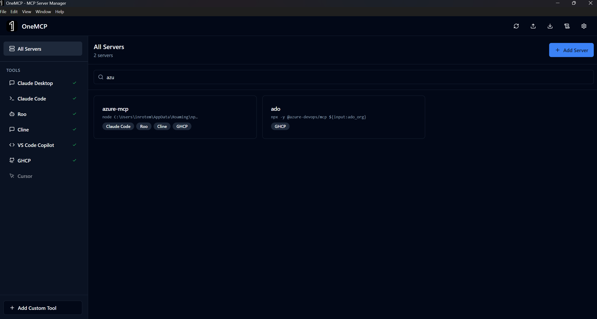

<p align="center">
  
</p>

# OneMCP

A unified MCP (Model Context Protocol) Server Manager for AI coding tools.

## Features

- **Manage MCP servers** across multiple AI tools from one place
- **Supported tools**: Claude Desktop, Claude Code, Roo, Cline, VS Code Copilot, GHCP, Cursor
- **Add, edit, clone, and delete** MCP server configurations
- **Test servers** to verify they're working
- **Sync servers** across all your tools with one click
- **Import/Export** configurations for backup and sharing
- **Dark theme** UI

## Screenshot



## Installation

### Option 1: Run from source

```bash
# Clone the repository
git clone https://github.com/InbarR/OneMCP.git
cd OneMCP

# Install dependencies
npm install

# Run in development mode
npm run dev
```

### Option 2: Download from Releases

Download the appropriate package for your platform from the [Releases](https://github.com/InbarR/OneMCP/releases) page:

- **Windows**: `OneMCP-Portable.exe` or the Squirrel installer
- **macOS**: `OneMCP-darwin-x64.zip`
- **Linux**: `.deb` (Debian/Ubuntu) or `.rpm` (Fedora/RHEL)

## Building

```bash
# Package the app for your platform
npm run package

# Create platform-specific installer
npm run make
```

Build outputs by platform:
- **Windows**: Squirrel installer in `out/make/squirrel.windows/`
- **macOS**: ZIP in `out/make/zip/darwin/`
- **Linux**: DEB in `out/make/deb/` and RPM in `out/make/rpm/`

## How it works

OneMCP reads and writes to the configuration files of each supported AI tool:

### Windows
| Tool | Config Path |
|------|-------------|
| Claude Desktop | `%APPDATA%/Claude/claude_desktop_config.json` |
| Claude Code | `~/.claude.json` |
| Roo | `%APPDATA%/Code/User/globalStorage/rooveterinaryinc.roo-cline/settings/mcp_settings.json` |
| Cline | `%APPDATA%/Code/User/globalStorage/saoudrizwan.claude-dev/settings/cline_mcp_settings.json` |
| VS Code Copilot | `%APPDATA%/Code/User/settings.json` |
| GHCP | `%APPDATA%/Code/User/mcp.json` |
| Cursor | `~/.cursor/mcp.json` |

### macOS
| Tool | Config Path |
|------|-------------|
| Claude Desktop | `~/Library/Application Support/Claude/claude_desktop_config.json` |
| Claude Code | `~/.claude.json` |
| Roo | `~/Library/Application Support/Code/User/globalStorage/rooveterinaryinc.roo-cline/settings/mcp_settings.json` |
| Cline | `~/Library/Application Support/Code/User/globalStorage/saoudrizwan.claude-dev/settings/cline_mcp_settings.json` |
| VS Code Copilot | `~/Library/Application Support/Code/User/settings.json` |
| GHCP | `~/Library/Application Support/Code/User/mcp.json` |
| Cursor | `~/.cursor/mcp.json` |

### Linux
| Tool | Config Path |
|------|-------------|
| Claude Desktop | `~/.config/Claude/claude_desktop_config.json` |
| Claude Code | `~/.claude.json` |
| Roo | `~/.config/Code/User/globalStorage/rooveterinaryinc.roo-cline/settings/mcp_settings.json` |
| Cline | `~/.config/Code/User/globalStorage/saoudrizwan.claude-dev/settings/cline_mcp_settings.json` |
| VS Code Copilot | `~/.config/Code/User/settings.json` |
| GHCP | `~/.config/Code/User/mcp.json` |
| Cursor | `~/.cursor/mcp.json` |

## Tech Stack

- Electron
- React 18
- TypeScript
- Vite
- Tailwind CSS
- shadcn/ui

## License

MIT
